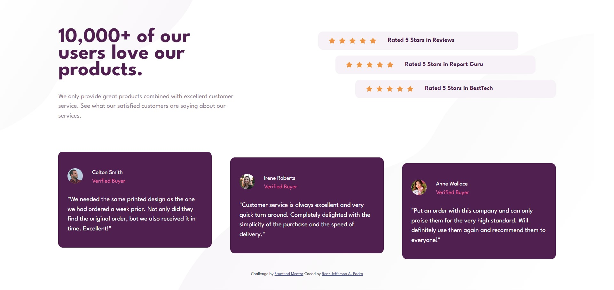

# Frontend Mentor - Social proof section solution

This is a solution to the [Social proof section challenge on Frontend Mentor](https://www.frontendmentor.io/challenges/social-proof-section-6e0qTv_bA). Frontend Mentor challenges help you improve your coding skills by building realistic projects. 

## Table of contents

- [The challenge](#the-challenge)
  - [Screenshot](#screenshot)
  - [Links](#links)
  - [Built with](#built-with)
- [Author](#author)

### The challenge

Users should be able to:

- View the optimal layout for the section depending on their device's screen size

### Screenshot

### Links

- Solution URL: [See solution here](https://www.frontendmentor.io/solutions/social-proof-section-designed-with-bootstrap-flexbox-and-custom-css-Z0yVGZ8jy4)
- Live Site URL: [Go to site](https://jeffabenoja.github.io/Social-Proof-Section/)

## My process

### Built with

- Semantic HTML5 markup
- CSS custom properties
- Flexbox
- Bootstrap
- Mobile-first workflow

## Author

- Facebook- [@wazsupabenoja](https://www.facebook.com/wazsupabenoja)
- Frontend Mentor - [@jeffabenoja](https://www.frontendmentor.io/profile/jeffabenoja)
- LinkedIn- [@jeffabenoja](https://www.linkedin.com/in/jeffabenoja/)
